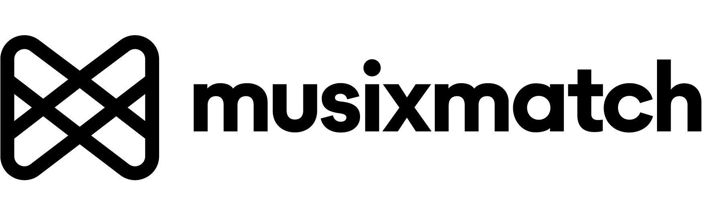

# n8n-nodes-musixmatch

<picture>
  <source media="(prefers-color-scheme: dark)" srcset=".github/musixmatch-logo-dark.png">
  <source media="(prefers-color-scheme: light)" srcset=".github/musixmatch-logo.png">
  
</picture>

This is an n8n community node that lets you use [Musixmatch](https://www.musixmatch.com/) in your n8n workflows.

Musixmatch is the world's largest lyrics catalog, providing access to millions of songs' lyrics, translations, subtitles, and music metadata. This node enables you to integrate Musixmatch's powerful API into your automation workflows.

[n8n](https://n8n.io/) is a [fair-code licensed](https://docs.n8n.io/sustainable-use-license/) workflow automation platform.

## Table of Contents

- [Installation](#installation)
- [Operations](#operations)
- [Credentials](#credentials)
- [Compatibility](#compatibility)
- [Usage](#usage)
- [Resources](#resources)

## Installation

Follow the [installation guide](https://docs.n8n.io/integrations/community-nodes/installation/) in the n8n community nodes documentation.

### Community Node Installation

1. Go to **Settings > Community Nodes** in your n8n instance
2. Select **Install**
3. Enter `n8n-nodes-musixmatch` in **Enter npm package name**
4. Agree to the [risks](https://docs.n8n.io/integrations/community-nodes/risks/) of using community nodes
5. Select **Install**

After installing the node, you can use it like any other node in your workflows.

## Operations

The Musixmatch node currently supports the following operations:

### Catalog Resource

- **Chart Tracks Get**: Retrieve the top charting tracks from a specific country
- **Track Get**: Get track information by Musixmatch Track ID
- **Track Lyrics Get**: Retrieve lyrics for a specific track
- **Track Lyrics Translation Get**: Get translated lyrics for a track in a specified language
- **Track Subtitle Get**: Retrieve subtitles (time-synced lyrics) for a track
- **Matcher Track Get**: Search and match a track by artist and track name

### Available Operations Details

#### Chart Tracks Get

Retrieve trending and top charting tracks from Musixmatch charts. You can filter by country and chart type (e.g., top, hot, mxmweekly).

#### Track Get

Fetch detailed information about a specific track using its Musixmatch Track ID, including metadata like artist name, album, release date, and more.

#### Track Lyrics Get

Access the lyrics of any track in the Musixmatch catalog by providing the Track ID.

#### Track Lyrics Translation Get

Get translated versions of lyrics in multiple languages. Perfect for multilingual applications and global audiences.

#### Track Subtitle Get

Retrieve time-synced subtitles (lyrics with timestamps) for karaoke applications, music players, or synchronized displays.

#### Matcher Track Get

Search for a track by providing the artist name and track title. This operation returns the best matching track from the Musixmatch database.

## Credentials

To use this node, you need a Musixmatch API key.

### Getting Your API Key

1. Visit [Musixmatch API Pricing](https://about.musixmatch.com/api-pricing?utm_source=github_n8n_node&utm_medium=web&utm_content=pricing_page_link) to view available plans
2. Subscribe to a plan that fits your needs
3. Once subscribed, you'll receive your API key
4. Copy your API key to use with this n8n node

### Setting Up Credentials in n8n

1. In your n8n workflow, add the Musixmatch node
2. Click on **Credential for Musixmatch API**
3. Select **Create New Credential**
4. Enter your **API Key**
5. Click **Save**

The node will automatically authenticate all API requests using your credentials.

## Compatibility

- **Minimum n8n version**: 1.0.0
- **Tested with n8n versions**: 1.119.2 and above

This node is built using the latest n8n community node standards and should be compatible with all recent versions of n8n.

## Usage

### Example Workflow: Get Trending Tracks with Lyrics

Here's a simple example that retrieves the top 10 trending tracks from the US charts and fetches their lyrics:

1. **Add Musixmatch node** configured to use **Chart Tracks Get** operation
   - Set **Country** to `US`
   - Set **Chart Name** to `top`
   - Set **Page Size** to `10`

2. **Add a second Musixmatch node** configured to use **Track Lyrics Get** operation
   - Use `{{ $json.track_id }}` from the previous node to fetch lyrics for each track

3. **Process the results** with other n8n nodes as needed (e.g., save to database, send to webhook, etc.)

### Example Workflow: Search and Translate Lyrics

1. **Add Musixmatch node** configured to use **Matcher Track Get** operation
   - Set **Artist Name** to the artist you want to search
   - Set **Track Name** to the song title

2. **Add a second Musixmatch node** configured to use **Track Lyrics Translation Get** operation
   - Use `{{ $json.track_id }}` from the previous node
   - Set **Language** to your desired language code (e.g., `es` for Spanish, `fr` for French)

### Tips

- The node is compatible with AI Agent workflows (marked as `usableAsTool`)
- All operations respect n8n's **Continue On Fail** setting for robust error handling
- Use the **Matcher Track Get** operation when you don't have a Track ID but know the artist and song name
- Rate limits depend on your Musixmatch API plan - consider implementing appropriate delays for large batch operations

## Resources

- [n8n community nodes documentation](https://docs.n8n.io/integrations/#community-nodes)
- [Musixmatch API Documentation](https://docs.musixmatch.com/lyrics-api/introduction?utm_source=github_n8n_node&utm_medium=web&utm_content=docs_link)
- [n8n Documentation](https://docs.n8n.io/)

## Support

For issues, questions, or contributions, please visit the [GitHub repository](https://github.com/musixmatchdev/n8n-nodes-musixmatch/issues).

---

_This is a community node and is not officially maintained by n8n. For official support, please contact Musixmatch directly._
